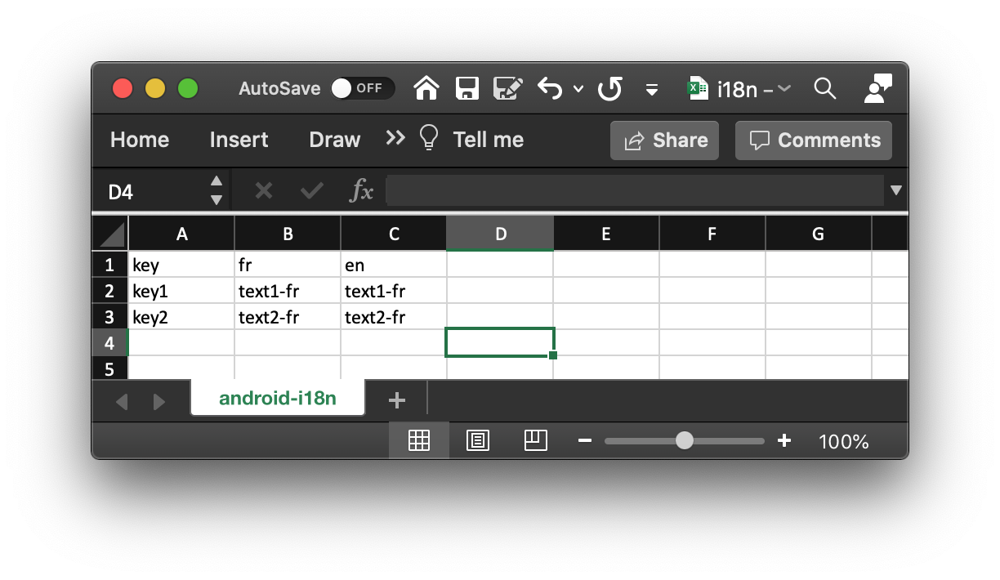

[](https://circleci.com/gh/denis-colliot/gradle-android-i18n)

# Introduction

The **androidI18n** gradle plugin automaticallly generates `strings.xml`
resources files from a given translations (i18n) source file.

The plugin provides the following gradle tasks:

- **`androidI18nImport`**: imports the i18n translations from the source file and generates the android resources for each supported locale:
  - `values/strings.xml`
  - `values-fr/strings.xml`
  - `values-es/strings.xml`

- **`androidI18nExport`**: export the android resources for all locales to a XLSX file in the `build` directory of the current module. The path of the generated XLSX file is displayed in the build output:

    ```
    ./gradlew app:androidI18nExport
    [...]
    > Task :app:androidI18nExport
    Resources were exported to:
    /path/to/app/build/i18n.xlsx
    [...]
    ```


# Installation

Follow the instructions described [here](https://plugins.gradle.org/plugin/com.github.gradle.android-i18n).


# Configuration

Simply add this configuration block to your `build.gradle` file:
```
androidI18n {

   // Source file containing i18n translations.
   sourceFile = '/path/to/source/file.xls'
   
   // Default android locale corresponding to 'values' directory.
   defaultLocale = 'en'
}
```

An empty (or blank) `sourceFile` simply disabled plugin execution (convenient for Continuous Integration).

# Usage

## Single module Gradle projects

When applied to the configuration of a single module eg `app`, the plugin operates in *single module* mode.

In this mode, the **export task** `androidI18nExport` will create an Excel spreadsheet with one sheet named `android-i18n` that contains all translation keys and the corresponding texts for each language.

<table>

<tr>
<td colspan="3">
<pre>
$ ./gradlew app:androidI18nExport
> Task :androidI18nExport
Resources were exported to:
/path/to/project/app/build/i18n_2020-09-15_11-50-50.xlsx
BUILD SUCCESSFUL in 6s
</pre>
</td>
</tr>

<tr>
<td>
<pre>
project
└── app
    └── src
        └── main
            └── res
                ├── values
                │   └── strings.xml
                └── values-fr
                    └── strings.xml
</pre>
</td>

<td>⇒</td>

<td>

</td>

</tr>
</table>

The **import task** `androidI18nImport` will take an Excel spreadsheet and generate a single set of `strings.xml` files (one file by language) into the directory structure of the single module.

<table>

<tr>
<td colspan="3">
<pre>
$ gradlew app:androidI18nImport
BUILD SUCCESSFUL in 28s
</pre>
</td>
</tr>

<tr>

<td>

</td>

<td>⇒</td>

<td>
<pre>
project
└── app
    └── src
        └── main
            └── res
                ├── values
                │   └── strings.xml
                └── values-fr
                    └── strings.xml
</pre>
</td>

</tr>
</table>

## Multi module gradle projects

TODO

# Supported sources

## Supported URI

### Samba URI
Pattern: `smb://<domain>;<login>:<password>@<host>/<path_to_file>`

The plugin uses [**jcifs**](https://jcifs.samba.org/) to establish a connection with the remote samba URI.

[Jcifs client properties](https://jcifs.samba.org/src/docs/api/overview-summary.html#scp) can be provided
through gradle project properties using prefix `androidI18n.*`:
```
androidI18n.jcifs.smb.client.dfs.disabled=true
androidI18n.jcifs.smb.client.responseTimeout=5000
```

### Windows UNC
Pattern: `\\<host>\<path_to_file>`


## Supported file types
For the moment, the plugin only supports `.xls` and `.xlsx` source file types. Files must respect following structure:

| key | fr | en | es |
|-----|----|----|----|
| home_text_1 | Bonjour le monde ! | Hello world! | ¡Hola Mundo! |
| home_text_2 | Avec un argument : # | With an argument: # | Con un argumento : # |
| plurals_key:one | Voiture | Car | Coche |
| plurals_key:other | Voitures | Cars | Coches |


# Publish plugin to the Gradle Plugin Portal

## Official guide

https://guides.gradle.org/publishing-plugins-to-gradle-plugin-portal/

## TL;DR

The following configuration should be set in your `~/.gradle/gradle.properties` file:

```shell script
gradle.publish.key=<api_key>
gradle.publish.secret=<secret>
```

Then simply run following command:

```shell script
$ ./gradlew publishPlugins
```

# Develop

To make changes to this plugin and test them in your project, you can use Gradle's composite build feature:

1. Clone this repository

2. Add this to `settings.gradle` in your project:

    ```groovy
    includeBuild('/path/to/gradle-android-i18n') {
        dependencySubstitution {
            substitute module("gradle.plugin.com.github.gradle:android-i18n") with project(':')
        }
    }
    ```
3. Now you can launch the `androidI18nImport` as usual from your project:

    ```shell script
    cd /path/to/your/project
    ./gradlew app:androidI18nImport
    ```
